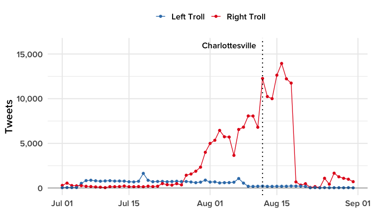
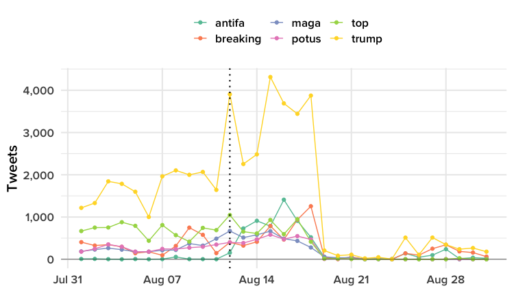
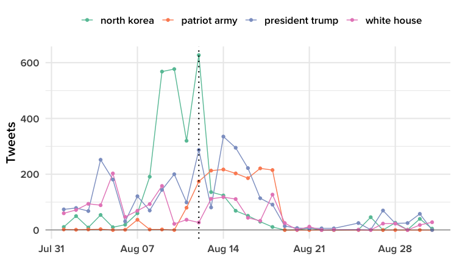

# Russian Trolls Swarmed The Charlottesville March — Then Twitter Cracked Down

```{r setup, include=FALSE}
library(knitr)
opts_chunk$set(out.width="900px", dpi=300)
```

Data and [R](https://www.r-project.org/) code to reproduce the analysis and graphics in this [Aug. 10, 2018 BuzzFeed News post](https://www.buzzfeednews.com/article/peteraldhous/russia-twitter-trolls-charlottesville) on the reaction of Twitter trolls operated by Russia's Internet Research Agency to the violence that erupted in Charlottesville, Virginia, in August 2017. Supporting files are in [this GitHub repository](https://github.com/BuzzFeedNews/2018-08-charlottesville-twitter-trolls).

### Data

On Jul. 31, 2018, researchers Darren Linvill and Patrick Warren of Clemson University in South Carolina [published with FiveThirtyEight](https://fivethirtyeight.com/features/why-were-sharing-3-million-russian-troll-tweets/) an archive of nearly 3 million tweets linked to accounts identified by Twitter in [two](https://democrats-intelligence.house.gov/uploadedfiles/exhibit_b.pdf) [lists](https://democrats-intelligence.house.gov/uploadedfiles/ira_handles_june_2018.pdf) provided to Congress as being linked to the Internet Research Agency. In February, special counsel Robert Mueller [indicted](https://www.justice.gov/file/1035477/download) the agency and 13 of its employees for interfering in US politics with “a strategic goal to sow discord.” 

BuzzFeed News obtained a new copy of the data directly from the researchers. This has been cleaned to address some small problems with the [publicly shared data](https://github.com/fivethirtyeight/russian-troll-tweets/), and filtered for tweets from the two main account types most active in trying to influence US politics, called "Left Trolls" and "Right Trolls" by Linvill and Warren. We also  processed the data for easier handling by time and date, and filtered for tweets sent from Jun. 19, 2015, a period for which the researchers are confident they have a complete record of tweets from the handles identified by Twitter.

Many of the Left Trolls posed as supporters of Black Lives Matter, tweeting about aspects of black culture as well as politics. They tended to support Bernie Sanders, disparage Hillary Clinton, and were most active before the 2016 presidential election. Right Trolls posed as supporters of Donald Trump, and were most active in the summer of 2017.

The data contains the following fields:

- `author` Account handle, in lower case.
- `content` Tweet content.
- `region` As [classified by Social Studio](https://help.salesforce.com/articleView?id=000199367&type=1), the software used by Linvill and Warren to compile the tweets.
- `language` Language in which the tweet was written.
- `tweet_date` `tweet_time` Date and time, in UTC, that the tweet was posted.
- `year` `month` `hour` `minute` Processed from the tweet date and time.
- `following` Number of accounts being followed by the author, at the time tweet was sent.
- `followers` Number of accounts folllowing the author, at the time tweet was sent.
- `post_url` URL for the tweet.
- `post_type` Null for original content, RETWEET or QUOTE TWEET.
- `retweet` 0 for original content, 1 for RETWEET or QUOTE TWEET.
- `tweet_id` Unique tweet code, from Twitter.
- `author_id` Author ID code from Twitter. Due to a glitch in data processing by the Clemson researchers, for earlier tweets these codes were turned into numbers and rounded, which means they cannot be reliably be used to identify accounts. Still, they may be useful for analysis of later tweets. 
- `account_category` Left Troll or Right Troll.
- `new_june_2018` 0 for accounts in the [list](https://democrats-intelligence.house.gov/uploadedfiles/exhibit_b.pdf) provided to Congress by Twitter in November 2017, 1 for accounts newly identified in the [extended list](https://democrats-intelligence.house.gov/uploadedfiles/ira_handles_june_2018.pdf) released in June 2018.

### Setting up

Required packages and regular expressions for processing tweet content; loading data.

```{r, results="hide", warning=FALSE, message=FALSE}
# load required packages
library(readr)
library(dplyr)
library(ggplot2)
library(tidytext)
library(tidyr)
library(stringr)
library(scales)
library(DT)

# regexes for parsing tweets
replace_reg <- "https?://[^\\s]+|&amp;|&lt;|&gt;|\\bRT\\b"
unnest_reg <- "([^A-Za-z_\\d#@']|'(?![A-Za-z_\\d#@]))"

# load data
tweets <- data_frame()

for (n in c(1:4)) {
   tmp <- read_csv(paste0("data/tweets",n,".csv"), col_types = cols(
     .default = col_character(),
     following = col_integer(),
     followers = col_integer(),
     tweet_date = col_date(),
     tweet_time = col_double(),
     year = col_integer(),
     month = col_integer(),
     hour = col_integer(),
     minute = col_integer()
   ))
   tweets <- bind_rows(tweets,tmp)
}
rm(tmp)
```

### Tweets from Russian Left and Right Trolls in July and August 2017

Left Trolls were most active before the 2016 election. But the summer of 2017 is when the Right Trolls had their biggest surge.

```{r, results="hide", warning=FALSE, message=FALSE, eval=FALSE}
# tweets per day, by category
tweets_category_day <- tweets %>%
  group_by(tweet_date,account_category) %>%
  count() %>%
  arrange(-n) %>%
  filter(grepl("left|right",account_category,ignore.case = TRUE))

# plot
ggplot(tweet_category_day, aes(x=tweet_date, y=n, color=account_category)) +
  scale_color_brewer(palette = "Set1", direction = -1, name = "") +
  geom_line() +
  geom_point() +
  xlab("") +
  ylab("Tweets") +
  scale_y_continuous(labels = comma) +
  scale_x_date(limits = c(as.Date("2017-07-01"),as.Date("2017-08-31"))) +
  geom_vline(aes(xintercept = as.Date("2017-08-12")), linetype="dotted", size=0.75) +
  geom_hline(aes(yintercept = 0), size = 0.2) +
  annotate("text", 
           x = as.Date("2017-08-05"), 
           y = 16000, 
           label = "Charlottesville",
           family = "ProximaNova-Semibold",
           size = 4.5) +
  theme_minimal(base_size = 16, base_family = "ProximaNova-Semibold") +
  theme(legend.position = "top",
        panel.grid.minor.x = element_blank())
```



### What did the Right Trolls tweet about in August 2017?

First we split the text of original tweets, excluding retweets, into individual words, filtering out common stop words from the [tidytext](https://cran.r-project.org/web/packages/tidytext/vignettes/tidytext.html) R package. Then we counted the tweets containing common words sent each day.

```{r, warning=FALSE, message=FALSE}
# filter for tweets sent by Right Trolls in August 2017
aug2017_right <- tweets %>%
  filter(year == 2017 
         & month == 8 
         & account_category == "Right Troll")

# break content into distinctive words
words <- aug2017_right %>% 
  mutate(text = str_replace_all(content, replace_reg, "")) %>%
  unnest_tokens(word, text) %>%
  anti_join(stop_words, by = "word") %>% 
  filter(str_detect(word, "[a-z]"))

# count tweets containing each of the 1000 most commonly used words 
tweets_words <- words %>%
  select(tweet_id,word) %>%
  unique() %>%
  group_by(word) %>%
  count() %>%
  arrange(-n) %>%
  head(1000) %>%
  rename(tweets = n)

# display in a searchable web table
datatable(tweets_words)
```

<br>

```{r, results="hide", warning=FALSE, message=FALSE, eval=FALSE}
# select words to be displayed in chart, either:
terms <- c("trump","breaking","top","potus","maga","antifa")

# or
terms <- c("antifa","charlottesville","violence","racist","statue","blm")

# count tweets per day containing each word
terms_df <- data_frame()

for (t in terms) {
  print(t)
  tmp <- aug2017_right %>%
    filter(grepl(t,content, ignore.case = TRUE)) %>%
    group_by(tweet_date) %>%
    count() %>%
    mutate(term = t)
  terms_df <- bind_rows(terms_df,tmp)
}
rm(tmp)

terms_df <- terms_df %>%
  spread(tweet_date,n)
terms_df[is.na(terms_df)] <- 0
terms_df <- terms_df %>%
  gather(date,count,-term) %>%
  mutate(date = as.Date(date, format="%Y-%m-%d"))

# plot
ggplot(terms_df, aes(x=date, y=count, color=term)) +
  scale_color_brewer(palette = "Set2", name="") +
  geom_line() +
  geom_point() +
  xlab("") +
  ylab("Tweets") +
  scale_y_continuous(labels = comma) +
  geom_vline(aes(xintercept = as.Date("2017-08-12")), linetype="dotted", size=0.75) +
  geom_hline(aes(yintercept = 0), size = 0.2) +
  theme_minimal(base_size = 16, base_family = "ProximaNova-Semibold") +
  theme(legend.position = "top",
        panel.grid.minor.x = element_blank())
```

#### Tweets per day by Right Trolls in August 2017 containing most commonly used words



#### Tweets per day by Right Trolls in August 2017 containing selected words that surged after Charlottesville


Then we repeated the process for word pairs, or bigrams, again filtering out those containing common stop words.

```{r, warning=FALSE, message=FALSE}
# break content into distinctive bigrams
bigrams <- aug2017_right %>% 
  mutate(text = str_replace_all(content, replace_reg, "")) %>%
  unnest_tokens(bigram, text, token = "ngrams", n = 2) %>%
  separate(bigram, into = c("first","second"), sep = " ", remove = FALSE) %>%
  anti_join(stop_words, by = c("first" = "word")) %>%
  anti_join(stop_words, by = c("second" = "word")) %>%
  filter(str_detect(first, "[a-z]"),
         str_detect(second, "[a-z]"))

# count tweets containing each of the 1000 most commonly used bigrams 
tweets_bigrams <- bigrams %>%
  select(tweet_id, bigram) %>%
  unique() %>%
  group_by(bigram) %>%
  count() %>%
  arrange(-n) %>%
  head(1000) %>%
  rename(tweets = n)

# display in a searchable web table
datatable(tweets_bigrams)
```

<br>

```{r, results="hide", warning=FALSE, message=FALSE, eval=FALSE}
# select bigrams to be displayed in chart, either:
bigrams <- c("north korea","president trump","white house","patriot army")

# or:
bigrams <- c("alt left","white supremacist","confederate statues","trump condemns")

# count tweets per day containing each word
bigrams_df <- data_frame()

for (b in bigrams) {
  print(b)
  tmp <- aug2017_right %>%
    filter(grepl(b,content, ignore.case = TRUE)) %>%
    group_by(tweet_date) %>%
    count() %>%
    mutate(bigram = b)
  bigrams_df <- bind_rows(bigrams_df,tmp)
}
rm(tmp)

bigrams_df <- bigrams_df %>%
  spread(tweet_date,n)
bigrams_df[is.na(bigrams_df)] <- 0
bigrams_df <- bigrams_df %>%
  gather(date,count,-bigram) %>%
  mutate(date = as.Date(date, format="%Y-%m-%d"))

# plot
ggplot(bigrams_df, aes(x = date, y = count, color = bigram)) +
  scale_color_brewer(palette = "Set2", name="") +
  geom_line() +
  geom_point() +
  xlab("") +
  ylab("Tweets") +
  scale_y_continuous(labels = comma) +
  geom_vline(aes(xintercept = as.Date("2017-08-12")), linetype = "dotted", size = 0.75) +
  geom_hline(aes(yintercept = 0), size = 0.2) +
  theme_minimal(base_size = 16, base_family = "ProximaNova-Semibold") +
  theme(legend.position = "top",
        panel.grid.minor.x = element_blank())
```

#### Tweets per day by Right Trolls in August 2017 containing most commonly used bigrams



#### Tweets per day by Right Trolls in August 2017 containing selected words that surged after Charlottesville


### When did each Right Troll account start and stop tweeting?

```{r, warning=FALSE, message=FALSE}
# first and last tweets for each account
stop_start <- tweets %>%
  filter(account_category == "Right Troll") %>%
  group_by(author) %>%
  summarize(first = min(tweet_date),
            last = max(tweet_date),
            duration = last-first)

# display in a searchable web table
datatable(stop_start, colnames = c("duration (days)" = "duration"))
```


### When were the peaks for Right Troll accounts going silent?

```{r, warning=FALSE, message=FALSE}
count_stop <- stop_start %>%
  group_by(last) %>%
  summarize(stops = n()) %>%
  arrange(-stops)

# display in a searchable web table
datatable(count_stop, colnames = c("date","accounts silenced"))
```

### Which Right Trolls were active during August 2017, and what was their history?

```{r,  warning=FALSE, message=FALSE}
# account history for Right Trolls tweeting in August 2017
aug2017_right_trolls <- aug2017_right %>%
  select(author) %>%
  unique() %>%
  inner_join(stop_start) %>%
  arrange(last)

# display in a searchable web table
datatable(aug2017_right_trolls, colnames = c("duration (days)" = "duration"))
```

### Summary data for Right Troll accounts tweeting in August 2017

```{r, warning=FALSE, message=FALSE}
# summary of accounts tweeting in August 2017
aug2017_summary <- aug2017_right_trolls %>%
  mutate(last = case_when(last == "2017-08-18" ~ "2017-08-18",
                          last < "2017-08-18" ~ "Before 2017-08-18",
                          last > "2017-08-18" ~ "After 2017-08-18"),
         first = case_when(first >= "2017-08-18" ~ "After 2017-08-18",
                           first < "2017-08-18" ~ "Before 2017-08-18")) %>%
    group_by(first,last) %>%
    count()

# display in a searchable web table
datatable(aug2017_summary, colnames = c("number of accounts" = "n"))
```

<br>